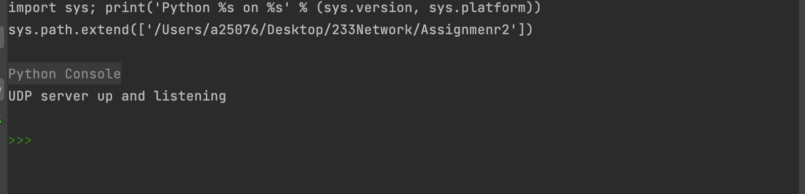
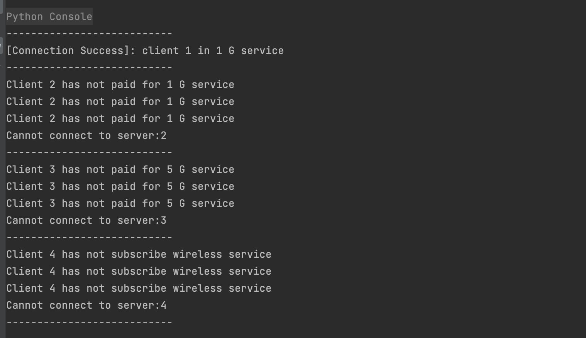
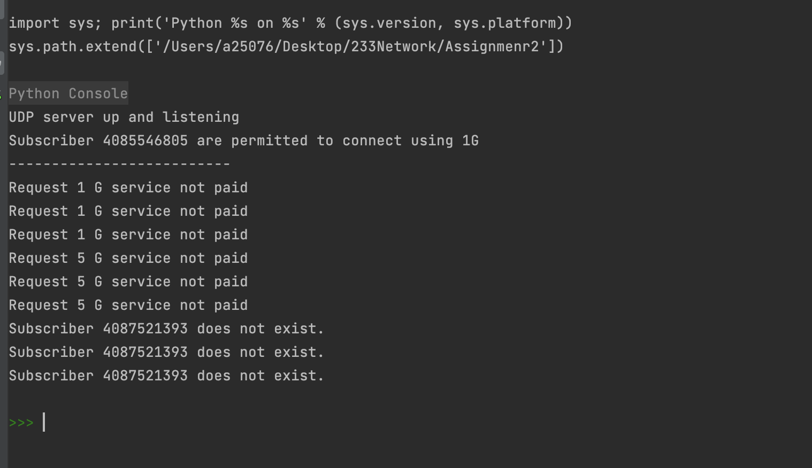
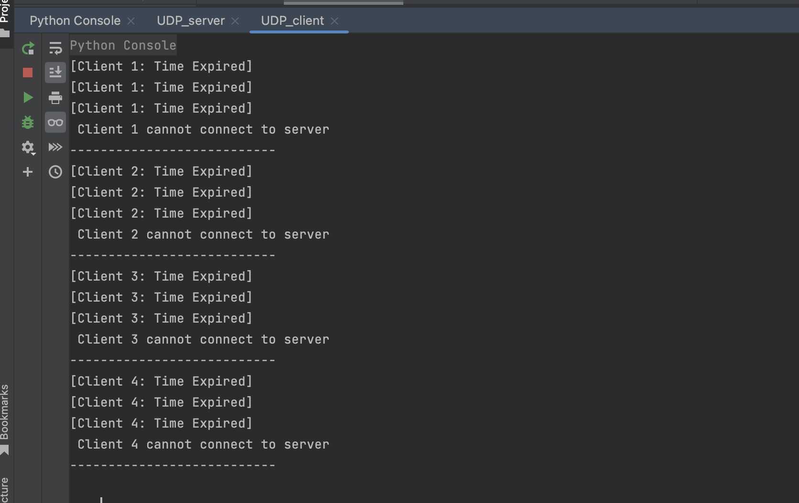

# UDP Protocol-based Simulate the process of mobile phone requesting unlimited network service from the provider
COEN 233 Computer Networks.

Program assignment 2: 

Client using customized protocol on top of UDP protocol for requesting identification from server for access permission to the cellular network.
Communication between one client and one server:

The client requests access information from server; the server will verify the validity of the request and will respond accordingly.
The communication between client and server will use the ack_timer, which was described in the first program assignment.

For the program assignment 2 you can imagine client’s software module is acting on behalf of a cell phone.

## Installation
Python 3.9.12

## Usage

Let server listening. **Run UDP_server.py first**. And you will get the output as below.

Noted that once you run UDP_server.py, means server will keep listening. That's why we can send messages continuously.

Then **run UDP_client.py** and get the client result and server result.

Easter Egg：maybe one of the client number is true.^_^

As you can see. When all pieces are received, the client will receive an additional ACK called [FULLY RECEIVED]. In real world, this means buffer has been cleaned.

Last part, time stamp:

Every message when sending will be in a try catch block. And if the client buffer does not receive any response from server, it will trigger a TimeOut Exception.
You can **test the timeout by exclusively running UDP_client.py**, which means the server cannot make any reactions as follows.

## Explanation

Server opens and reads a file named “Verification_Database.txt”, the contents of this file will be saved on the server, which contains the Subscriber’s Number, Technology, and payment status (paid = 1, not paid = 0).

Verification Database Format:

| Subscriber Number | Technology | Paid	 |
|-----------------|------------|-----------------|
| 408-554-6805 | 04         |1	(1 paid) |
|408-666-8821| 03         |0	(0 not paid)|
|408-680-8821 | 02         |1	(1 paid) |

Consider two cases in which the subscriber does not exist:
1.	Subscriber number is not found.
2.	Subscriber number is found, but the technology does not match.

## License
MIT License

Copyright (c) [2023] [Ningchen Liang]

Permission is hereby granted, free of charge, to any person obtaining a copy
of this software and associated documentation files (the "Software"), to deal
in the Software without restriction, including without limitation the rights
to use, copy, modify, merge, publish, distribute, sublicense, and/or sell
copies of the Software, and to permit persons to whom the Software is
furnished to do so, subject to the following conditions:

The above copyright notice and this permission notice shall be included in all
copies or substantial portions of the Software.

THE SOFTWARE IS PROVIDED "AS IS", WITHOUT WARRANTY OF ANY KIND, EXPRESS OR
IMPLIED, INCLUDING BUT NOT LIMITED TO THE WARRANTIES OF MERCHANTABILITY,
FITNESS FOR A PARTICULAR PURPOSE AND NON INFRINGEMENT. IN NO EVENT SHALL THE
AUTHORS OR COPYRIGHT HOLDERS BE LIABLE FOR ANY CLAIM, DAMAGES OR OTHER
LIABILITY, WHETHER IN AN ACTION OF CONTRACT, TORT OR OTHERWISE, ARISING FROM,
OUT OF OR IN CONNECTION WITH THE SOFTWARE OR THE USE OR OTHER DEALINGS IN THE
SOFTWARE.
## Contact
ningchenliang98@gmail.com
## Acknowledgements
Thanks to the guideline provided by 233 prof, Mr.Sung. and his good grader.